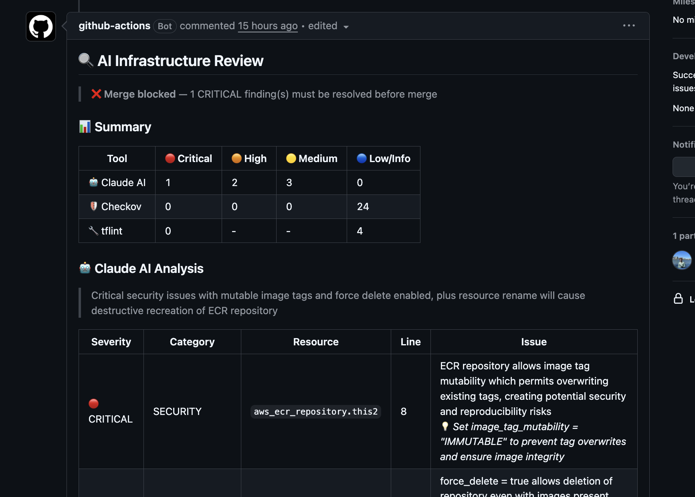
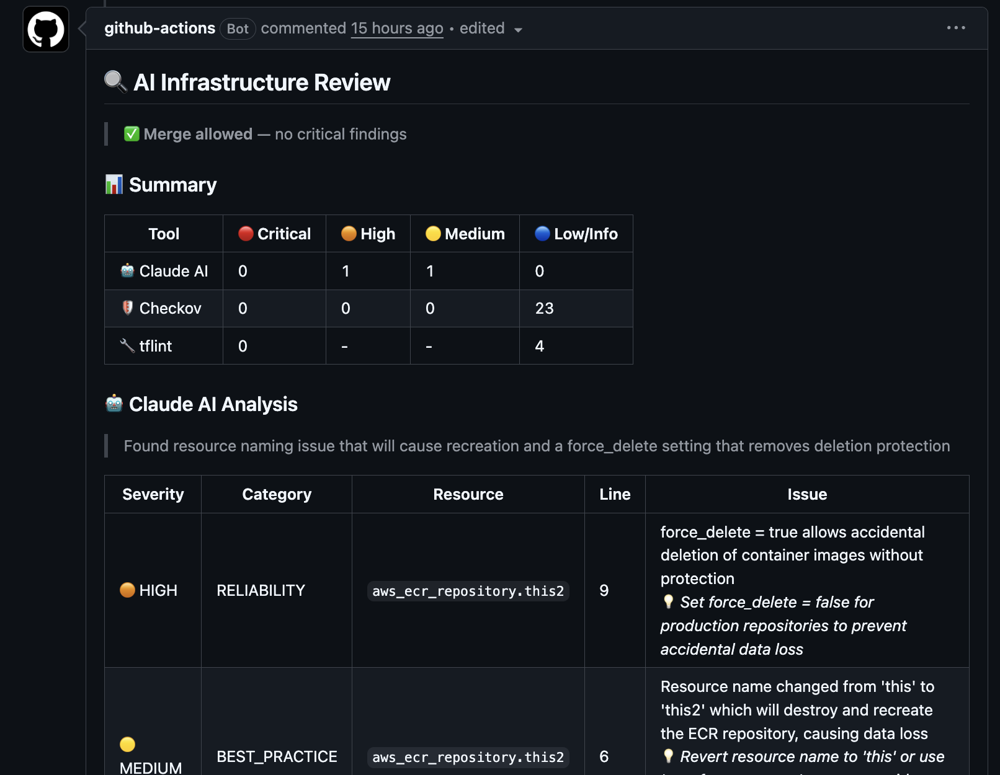
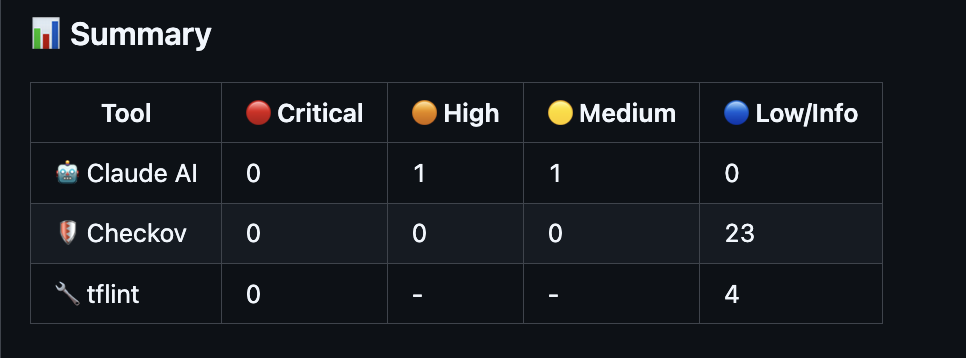

# AI Infra Reviewer

An AI-powered Terraform code review pipeline that intercepts infrastructure PRs, runs static analysis and LLM-based reasoning, and blocks merges on critical findings via OPA policy gates.

Validated against the Terraform codebase of [TaskFlow](https://github.com/Sai9700128/tf_shipforge), a production-grade EKS platform managing 40+ AWS resources.

---

## Demo

### ❌ Merge Blocked — CRITICAL finding detected



### ✅ Merge Allowed — no critical findings



### 🔍 PR Comment — full findings table



---

## How It Works

```
PR opened (touching .tf files)
        ↓
GitHub Actions triggers
        ↓
tflint + Checkov  →  static findings (JSON)
        ↓
Claude API  →  AI review of diff (severity-tiered JSON)
        ↓
OPA Rego policy gate  →  pass / fail
        ↓
PR comment posted with findings table
```

The static analysis layer (tflint, Checkov) runs first to filter out known-bad patterns before the AI call. Claude only sees what deterministic rules can't reason about — reducing noise and token cost.

---

## Stack

| Layer | Tool |
|---|---|
| Pipeline | GitHub Actions |
| Static analysis | tflint, Checkov |
| AI review | Claude API (claude-sonnet) |
| Policy enforcement | OPA (Rego) |
| PR feedback | GitHub API |

---

## What Gets Flagged

- **Security** — publicly accessible RDS, overly permissive IAM, missing encryption, mutable image tags
- **Reliability** — no deletion protection on stateful resources, missing health checks, destructive resource renames
- **Cost** — redundant NAT Gateways, oversized instances for non-prod environments
- **Best practices** — missing tags, hardcoded values, no remote state backend

Findings are severity-tiered: `CRITICAL`, `HIGH`, `MEDIUM`, `INFO`.

---

## Policy Gate

OPA Rego policies consume the structured JSON output from Claude and enforce merge rules:

- `CRITICAL` → pipeline fails, merge blocked
- `HIGH` → warning posted, merge allowed
- `MEDIUM` / `INFO` → included in PR comment, no gate

Policy rules live in `policies/` as `.rego` files — auditable and reviewable independently of pipeline code.

---

## PR Comment Output

Every PR gets a structured comment with:

- **Policy banner** — merge blocked or allowed at a glance
- **Summary table** — finding counts per tool per severity
- **Claude AI Analysis** — contextual reasoning with suggestions
- **tflint findings** — syntax and validity errors
- **Checkov findings** — security and compliance violations

Comment is updated in-place on every push — no comment spam.

---

## Design Decisions

**Why OPA over Python conditionals for the policy gate**
OPA keeps enforcement logic declarative and auditable. Rules live in `.rego` files that a security team can review independently of application code. Python exit codes bury policy logic inside pipeline scripts with no clean separation.

**Why tflint + Checkov run before the AI call**
Deterministic tools are fast and cheap. Running Claude on every finding a linter already catches deterministically wastes tokens and adds latency. Pre-filtering means AI only evaluates what rules can't reason about holistically — combinations of misconfigurations, intent, naming context.

**Why a separate repo instead of embedding in TaskFlow**
The reviewer is a reusable tool, not a TaskFlow feature. Keeping it separate means it can be dropped into any Terraform repo with a single workflow reference. TaskFlow uses it as a consumer, not a host.

**Why structured JSON output from Claude**
Free-form AI responses can't drive automated enforcement. Prompting Claude to return `{ findings: [{ severity, category, line, description, suggestion }] }` makes the output machine-readable and directly consumable by the OPA policy gate without parsing heuristics.

**Why the pipeline only triggers on `.tf` file changes**
No point running a full AI review on a README update or config change. The `paths: '**.tf'` filter ensures the pipeline only fires when infrastructure actually changes — reducing noise and API costs.

---

## Usage in Another Repo

Call this as a reusable workflow from any repo with Terraform:

```yaml
# .github/workflows/infra-review.yml
jobs:
  ai-review:
    name: Review Terraform Changes
    uses: Sai9700128/AI_infra_reviewer/.github/workflows/review.yaml@main
    permissions:
      contents: read
      pull-requests: write
    secrets:
      ANTHROPIC_API_KEY: ${{ secrets.ANTHROPIC_API_KEY }}
```

---

## Related

- [ShipForge](https://github.com/Sai9700128/tf_shipforge) — the EKS platform this reviewer runs against
